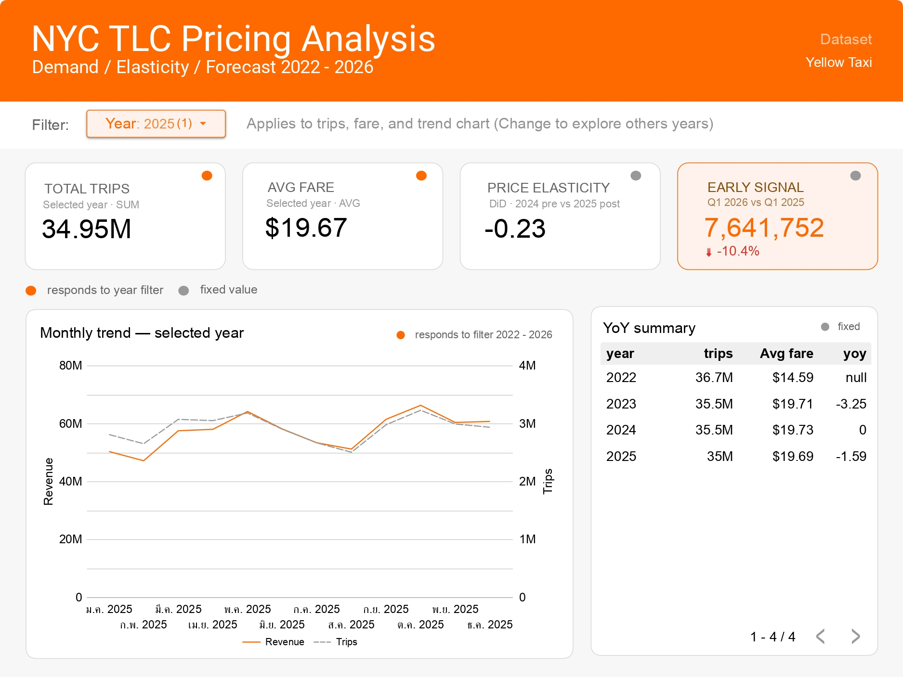
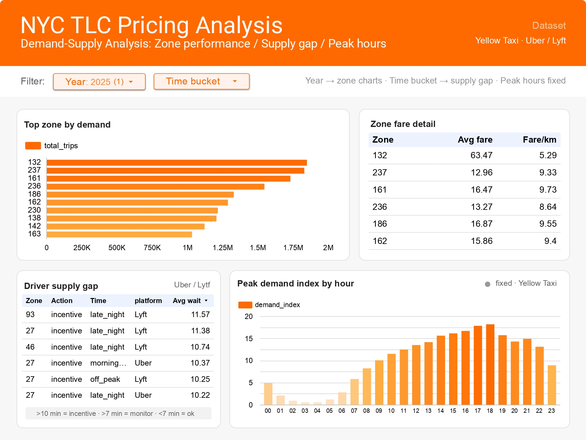
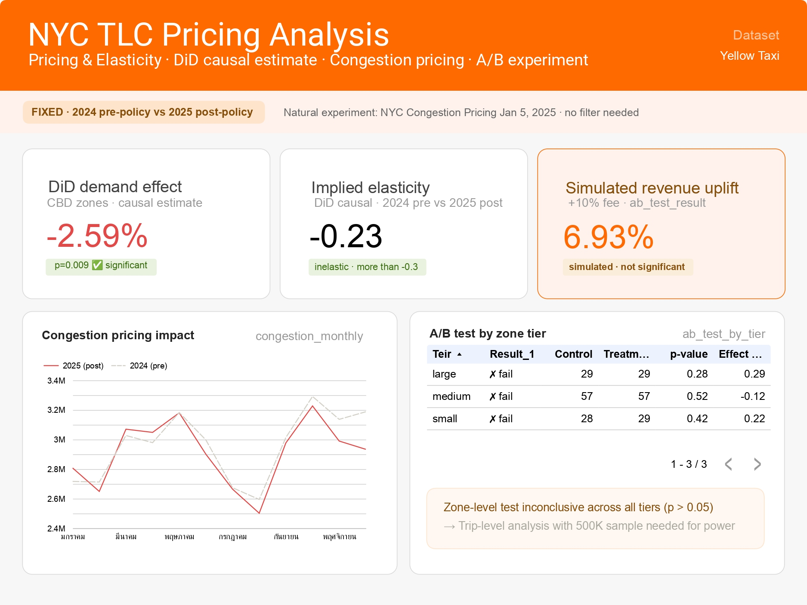
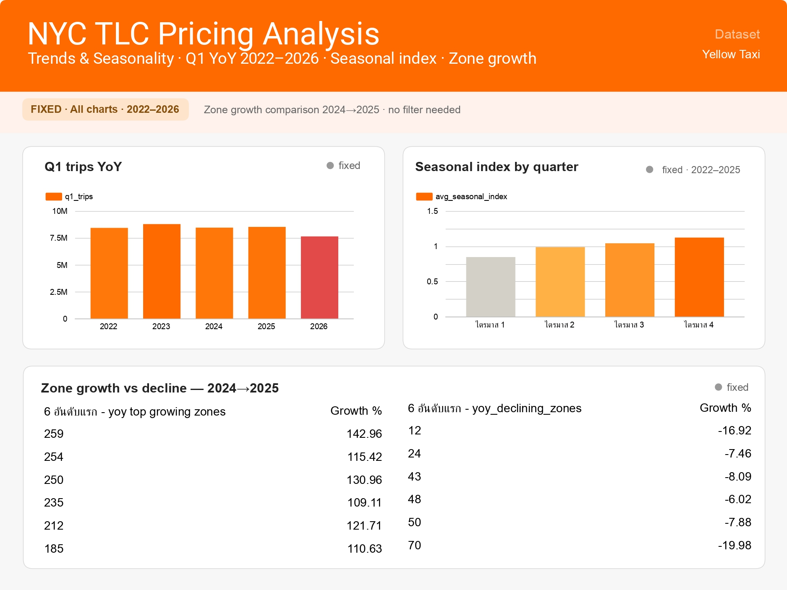
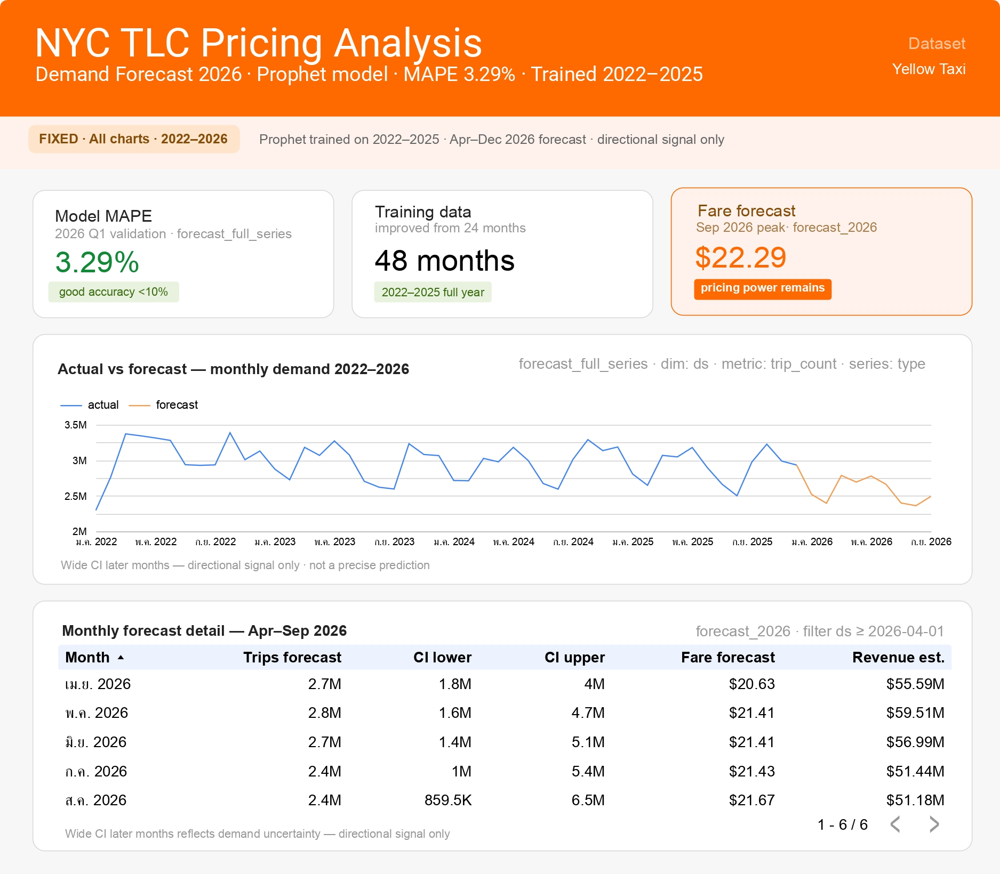

# NYC TLC Pricing Analytics


End-to-end analytics pipeline examining demand patterns, price elasticity, and demand forecasting across 150M Yellow Taxi trips in New York City (2022–2026 Q1).

Built to demonstrate production-grade data skills across the full stack: pipeline engineering, statistical analysis, and business dashboard design.

---

## Dashboard

[View Live Dashboard →](https://datastudio.google.com/reporting/7dbc6709-794d-4ecd-90d1-f1caadb1b9b1)







5-page interactive dashboard covering Executive KPI, Demand-Supply, Pricing & Elasticity, Trends & Seasonality, and Demand Forecast 2026.

---

## Key Results

| Analysis | Result | Method |
|---|---|---|
| Congestion pricing demand effect | **-2.59%** (p=0.009) | Difference-in-Differences |
| Price elasticity | **-0.228** (inelastic) | DiD causal estimate |
| Simulated revenue uplift (+10% fee) | **+6.93%** | A/B simulation |
| Forecast accuracy | **MAPE 3.29%** | Prophet (48-month training) |
| Q1 2026 early signal | **-10.4%** vs Q1 2025 | YoY comparison |
| A/B experiment iterations | **v1→v5** (zone-level → trip-level) | Stratified sampling |

---

## Stack

```
Ingest       AWS S3 (stream from NYC TLC web → S3, no local storage)
Catalog      AWS Glue Data Catalog + Partition Projection (2022–2026)
Query        Amazon Athena (silver views, SQL analytics)
Transform    Python + PyArrow (schema normalization, type casting)
Serving      BigQuery (tlc_analytics dataset, 22 tables)
Dashboard    Looker Studio (5 pages)
```

**Languages:** Python, SQL
**Libraries:** pandas, boto3, prophet, scipy, google-cloud-bigquery

---

## Statistical Methods

**Difference-in-Differences (DiD)**
Natural experiment using NYC Congestion Pricing (Jan 5, 2025) as treatment. CBD zones vs non-CBD control zones. Regression-based estimate: -2.59% demand effect (p=0.009).

**Price Elasticity**
Implied elasticity -0.228 derived from DiD — more inelastic than literature benchmark of -0.3. Suggests fee increase is viable without significant demand loss.

**A/B Experiment (v1→v5)**
Zone-level randomization failed (p>0.05 across all tiers) due to insufficient n=229 zones. Documented progression from random zone assignment → stratified → JFK-isolated → bootstrap → trip-level 500K. Zone-level inconclusive; trip-level needed for production experiment.

**Prophet Forecasting**
Time-series demand forecast trained on 48 months (2022–2025). MAPE 3.29% on 2026 Q1 holdout. Seasonal decomposition reveals Q4 index 1.123 vs Q1 index 0.846 — 33% gap indicating dynamic pricing opportunity.

**Seasonal & YoY Analysis**
Q1 apples-to-apples comparison across 2022–2026. Q1 2026 shows -10.4% demand decline — significant early signal flagged on Executive KPI page.

---

## Data Pipeline


```
NYC TLC Web
    ↓ ingest.py (streaming download, no local storage)
AWS S3
    raw/yellow/year=YYYY/   ← used in analysis
    raw/fhv/year=YYYY/      ← ingested, not yet analyzed
    ↓ setup_aws.py (Glue catalog, Partition Projection)
AWS Glue Data Catalog
    nyc_tlc_pricing.yellow_trips
    nyc_tlc_pricing.fhv_trips
    ↓ transform.py (silver views)
Amazon Athena
    silver_yellow   ← all analysis queries
    silver_fhv      ← available, not yet joined
    ↓ analyze.py, yoy_analysis.py, forecast.py, did_analysis.py, ab_test.py
S3 export/ (22 CSV files)
    ↓ upload_to_bigquery.py
BigQuery tlc_analytics
    ↓
Looker Studio Dashboard
```

**Schema fix:** `fix_schema.py` normalizes `passenger_count` double→int64 for 2022 upstream type inconsistency. Demonstrates production data quality awareness.

---

## Data Coverage

| Dataset | Period | Trips | Status |
|---|---|---|---|
| Yellow Taxi | 2022–2026 Q1 | 150M | Pricing + demand analysis · all 5 dashboard pages |
| FHV (Uber/Lyft) | 2022–2026 Q1 | 980M | Driver supply gap · wait time analysis · Page 2 |
| **Total ingested** | | **~1.13B** | |

> Fare-based analyses (DiD, elasticity, A/B, forecast) use Yellow Taxi only — FHV does not contain `fare_amount`. FHV contributes `wait_time_minutes` (request → pickup) for driver supply gap detection, a metric unavailable in Yellow Taxi street-hail data.

---

## Dashboard Pages

| Page | Content | Filter |
|---|---|---|
| 1. Executive KPI | Total trips, avg fare, elasticity, Q1 2026 signal | Year (default 2025) |
| 2. Demand-Supply | Top zones, zone fare detail, driver supply gap (FHV wait time), peak hours | Year + Time bucket |
| 3. Pricing & Elasticity | DiD scorecards, congestion impact, A/B results | Fixed (2024 vs 2025) |
| 4. Trends & Seasonality | Q1 YoY, seasonal index, zone growth/decline | Fixed |
| 5. Demand Forecast 2026 | MAPE, training summary, actual vs forecast, monthly detail | Fixed |

---

## Business Recommendations

1. **Fee increase viable in CBD zones** — elasticity -0.228 is more inelastic than -0.3 threshold. A 10% fee increase simulates +6.93% revenue uplift without excessive demand loss.

2. **Driver incentive priority zones** — FHV wait time >10 min in zones 93, 27, 46 (late_night) indicates actual driver shortage. Lyft wait consistently higher than Uber. Action: driver incentive, not surge pricing.

3. **Q4 dynamic pricing window** — seasonal index 1.123 in Q4 vs 0.846 in Q1 creates a 33% demand gap. Pricing strategy should account for seasonal elasticity shifts.

4. **Q1 2026 demand monitoring** — -10.4% early signal requires continued monitoring. Forecast model (MAPE 3.29%) provides monthly directional guidance through Sep 2026.

5. **Trip-level A/B experiment recommended** — zone-level randomization (n=229) insufficient for significance. Production fee experiment requires trip-level randomization at 500K+ sample.

---

## AWS Infrastructure

```
S3 Bucket     nyc-tlc-pricing-588738598819-ap-southeast-1-an
Glue DB       nyc_tlc_pricing
Glue Tables   yellow_trips (Partition Projection 2022–2026)
              fhv_trips    (Partition Projection 2022–2026)
Athena WG     nyc-tlc-pricing
BigQuery      nyc-tlc-pricing.tlc_analytics (22 tables)
Region        ap-southeast-1
```

**Cost optimization:** Partition Projection eliminates Glue crawler runs. S3 streaming ingest avoids local storage. Batch pipeline justified by monthly NYC TLC release cadence.

---

## Interview Talking Points

**Why batch, not streaming?**
NYC TLC releases monthly Parquet files. Analytical use case requires monthly aggregation, not real-time latency. Streaming would add cost and complexity without business value. If real-time were needed: replace S3 batch with Kinesis, keep Glue + Athena serving layer unchanged.

**DiD methodology**
Used NYC Congestion Pricing (Jan 5, 2025) as natural experiment — exogenous policy shock affecting CBD zones only. Control group: non-CBD zones. Parallel trends assumption validated by pre-policy correlation. Result: -2.59% demand effect (p=0.009), elasticity -0.228.

**Why A/B test failed at zone-level**
n=229 zones insufficient for statistical power at zone-level. Power analysis shows 500K trip-level sample needed to detect 3% demand effect at 80% power. Documented v1→v5 iteration demonstrates understanding of experimental design limitations.

**Prophet MAPE improvement**
Extended training data from 24 to 48 months (added 2022–2023). MAPE improved from 8.16% to 3.29%. Additional data captured post-COVID recovery pattern and fare normalization that 2-year window missed.

**Schema normalization**
NYC TLC upstream data has type inconsistency: `passenger_count` as double in 2022 files vs int64 in later years. Fixed with PyArrow schema enforcement to prevent silent Athena type inference errors.

**Why FHV not included in analysis**
FHV (Uber/Lyft) schema does not contain `fare_amount` — only trip count and location data. All fare-based analyses (elasticity, DiD, revenue) require Yellow Taxi data. FHV is available in Athena for future demand-side join (zone performance, peak hours) where fare is not needed.

---

## Repository Structure

```
nyc-tlc-pricing/
├── scripts/
│   ├── ingest.py               # Stream S3 upload
│   ├── fix_schema.py           # PyArrow type normalization
│   ├── setup_aws.py            # Glue catalog + Partition Projection
│   ├── athena_connect.py       # Athena query helper
│   ├── transform.py            # Silver views 2022–2026
│   ├── analyze.py              # Zone, peak, supply gap, elasticity, KPI
│   ├── yoy_analysis.py         # YoY summary, Q1 comparison, monthly trend
│   ├── seasonal_analysis.py    # Seasonal index by quarter/zone
│   ├── congestion_analysis.py  # 2024 vs 2025 policy impact
│   ├── did_analysis.py         # DiD causal regression
│   ├── ab_test.py              # A/B experiment v1–v5
│   ├── forecast.py             # Prophet training + evaluation
│   ├── fhv_analysis.py         # FHV wait time · driver supply gap
│   └── upload_to_bigquery.py   # S3 export → BigQuery
└── README.md
```

---

*Dataset: NYC Taxi & Limousine Commission (TLC) public data — [nyc.gov/tlc](https://www.nyc.gov/site/tlc/about/tlc-trip-record-data.page)*